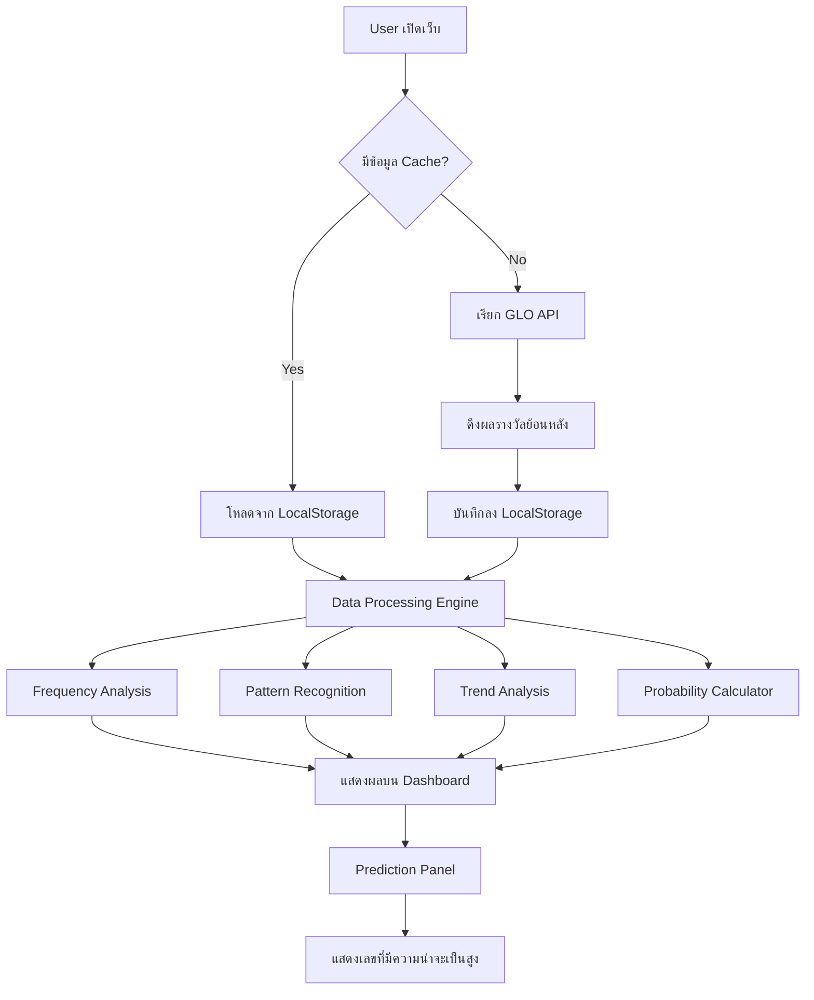

# 🎰 Thai Lottery Prediction System - System Flow

## ภาพรวมระบบ (System Overview)

ระบบคำนวณล็อตเตอรี่ไทย เป็นเว็บแอปพลิเคชันที่ใช้หลักสถิติและความน่าจะเป็นทางคณิตศาสตร์ ในการวิเคราะห์ข้อมูลผลรางวัลย้อนหลัง เพื่อแนะนำตัวเลขที่มีความน่าจะเป็นสูงที่สุด

> ⚠️ **Disclaimer**: ระบบนี้ใช้หลักทางสถิติเท่านั้น การออกรางวัลเป็นการสุ่ม ไม่มีระบบใดสามารถรับประกันผลลัพธ์ได้

---

## 🏗️ Architecture Overview

```
┌─────────────────────────────────────────────────────┐
│                    Frontend (HTML/CSS/JS)            │
│  ┌──────────┐ ┌───────────┐ ┌────────────────────┐  │
│  │ Dashboard │ │ Analysis  │ │  Prediction Engine │  │
│  │   Panel   │ │   Panel   │ │      Panel         │  │
│  └──────────┘ └───────────┘ └────────────────────┘  │
│                      │                               │
│              ┌───────┴───────┐                       │
│              │  Data Manager │                       │
│              └───────┬───────┘                       │
│                      │                               │
│  ┌───────────────────┴────────────────────────────┐  │
│  │           Local Storage (Cache)                │  │
│  └────────────────────────────────────────────────┘  │
└────────────────────┬────────────────────────────────┘
                     │ API Calls
                     ▼
┌────────────────────────────────────────────────────┐
│          GLO API (glo.or.th)                       │
│  POST /api/checking/getLotteryResult               │
└────────────────────────────────────────────────────┘
```

---

## 📊 Data Flow



---

## 🧮 Mathematical Models (โมเดลทางคณิตศาสตร์)

### Model 1: Frequency Analysis (การวิเคราะห์ความถี่)

**หลักการ:** นับจำนวนครั้งที่แต่ละตัวเลขปรากฏในผลรางวัลย้อนหลัง

```
Frequency(digit) = count(digit appears in results) / total_draws

สูตร:
f(x) = Σ(x ∈ results) / N

โดยที่:
- x = ตัวเลข (0-9) ในแต่ละตำแหน่ง
- N = จำนวนงวดทั้งหมด
```

**การใช้งาน:**
- วิเคราะห์ตัวเลขแต่ละหลัก (หลักแสนถึงหลักหน่วย)
- วิเคราะห์คู่ตัวเลข (2 ตัว), กลุ่ม 3 ตัว
- แยกวิเคราะห์ตาม position (หน้า 3 ตัว, ท้าย 3 ตัว, ท้าย 2 ตัว)

### Model 2: Hot/Cold Number Analysis (เลขร้อน/เลขเย็น)

**หลักการ:** วิเคราะห์ตัวเลขที่ออกบ่อย (Hot) และออกน้อย (Cold) ในช่วงเวลาล่าสุด

```
Hot Score = Recent_Frequency(last N draws) × Weight
Cold Score = 1 / (draws_since_last_appearance + 1)

Weighted Score = α × Hot_Score + β × Cold_Score
โดยที่ α + β = 1 (default: α=0.6, β=0.4)
```

**ตรรกะ:**
- เลขร้อน → มีแนวโน้มจะออกต่อ (Momentum Theory)
- เลขเย็น → ครบกำหนดจะออก (Mean Reversion Theory)

### Model 3: Gap Analysis (การวิเคราะห์ช่วงห่าง)

**หลักการ:** วิเคราะห์ช่วงห่างระหว่างครั้งที่ตัวเลขปรากฏ

```
Average Gap(x) = Σ(gap_i) / count(gaps)
Expected Next = last_appearance + Average_Gap

Gap Score = |current_gap - avg_gap| / std_dev(gaps)
```

### Model 4: Digit Position Correlation (ความสัมพันธ์ตำแหน่ง)

**หลักการ:** วิเคราะห์ความสัมพันธ์ระหว่างตัวเลขในตำแหน่งต่างๆ

```
Correlation(pos_i, pos_j) = Σ(digit_i × digit_j) / N - mean_i × mean_j
                            ─────────────────────────────────────────────
                                        std_i × std_j
```

### Model 5: Composite Prediction Score (คะแนนรวม)

**หลักการ:** รวมผลจากทุก Model เพื่อให้คะแนนแต่ละตัวเลข

```
Final Score(x) = w₁ × Frequency_Score(x)
               + w₂ × HotCold_Score(x)
               + w₃ × Gap_Score(x)
               + w₄ × Correlation_Score(x)

โดยที่: w₁ + w₂ + w₃ + w₄ = 1
Default: w₁=0.30, w₂=0.25, w₃=0.25, w₄=0.20
```

---

## 🔄 Processing Pipeline

### Step 1: Data Collection (รวบรวมข้อมูล)
```
Input: ผลรางวัลย้อนหลัง N งวด
Process: ดึงข้อมูลจาก GLO API → จัดรูปแบบ → Cache
Output: Array of lottery results
```

### Step 2: Data Preprocessing (เตรียมข้อมูล)
```
Input: Raw lottery results
Process:
  - แยกตัวเลขตามตำแหน่ง (หลักแสน, หลักหมื่น, ...)
  - แยกเป็น 2-digit, 3-digit combinations
  - สร้าง frequency tables
Output: Structured data matrices
```

### Step 3: Analysis (วิเคราะห์)
```
Input: Structured data
Process:
  - Frequency counting per position
  - Hot/Cold classification
  - Gap calculation
  - Correlation analysis
Output: Analysis scores per digit/number
```

### Step 4: Prediction (ทำนาย)
```
Input: Analysis scores
Process:
  - Weighted combination of all models
  - Ranking by composite score
  - Confidence interval calculation
Output: Top predicted numbers with confidence %
```

### Step 5: Visualization (แสดงผล)
```
Input: Predictions + analysis data
Process:
  - Render charts (frequency, trend, heatmap)
  - Display top predictions
  - Show statistical insights
Output: Interactive dashboard
```

---

## 📱 UI Components

### 1. Dashboard (หน้าแรก)
- สรุปผลรางวัลงวดล่าสุด
- เลขเด็ด Top 10 จากการวิเคราะห์
- สถิติรวม

### 2. Analysis Panel (แผงวิเคราะห์)
- กราฟความถี่ตัวเลข (Bar Chart)
- Heatmap ตำแหน่ง × ตัวเลข
- Trend Chart เทรนด์ตัวเลขตามเวลา
- Hot/Cold Number Display

### 3. Prediction Panel (แผงทำนาย)
- เลขที่มั่นใจสูงสุด 6 หลัก
- เลขท้าย 2 ตัว Top 5
- เลขท้าย 3 ตัว Top 5
- เลขหน้า 3 ตัว Top 5
- ระดับความมั่นใจ (Confidence Level)

### 4. History Panel (ประวัติ)
- ตารางผลรางวัลย้อนหลัง
- ค้นหาตามวันที่
- กรองตามประเภทรางวัล

---

## 🗂️ File Structure

```
lottary/
├── index.html          # หน้าเว็บหลัก
├── index.css           # Stylesheet หลัก
├── app.js              # Main application logic
├── data.js             # Data management & API calls
├── analysis.js         # Statistical analysis engine
├── prediction.js       # Prediction algorithms
├── charts.js           # Chart rendering utilities
├── result_api.md       # API Documentation
├── system_flow.md      # System Flow (ไฟล์นี้)
├── mathematical_models.md  # รายละเอียด Models
└── README.md           # Project README
```

---

## ⚙️ Technology Stack

| Component     | Technology              |
|---------------|-------------------------|
| Frontend      | HTML5, CSS3, JavaScript |
| Charts        | Canvas API + Custom     |
| Data Storage  | LocalStorage            |
| API           | GLO REST API            |
| Math Library  | Custom (Vanilla JS)     |

---

## 🔒 Limitations & Disclaimers

1. **ลอตเตอรี่ = การสุ่ม** - ทุกตัวเลขมีโอกาสเท่ากัน (1/1,000,000 สำหรับ 6 หลัก)
2. **ไม่มี Memory** - ผลงวดก่อนไม่มีผลต่องวดถัดไป (Independent Events)
3. **สถิติ ≠ การรับประกัน** - ข้อมูลสถิติเป็นเพียงแนวทางไม่ใช่คำตอบ
4. **เพื่อการศึกษาเท่านั้น** - ระบบนี้สร้างเพื่อการเรียนรู้หลักสถิติและความน่าจะเป็น
